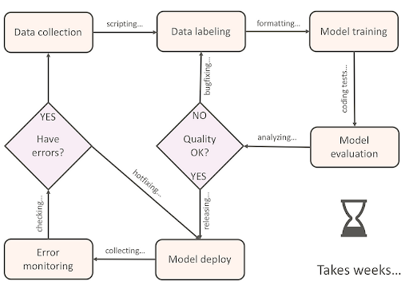
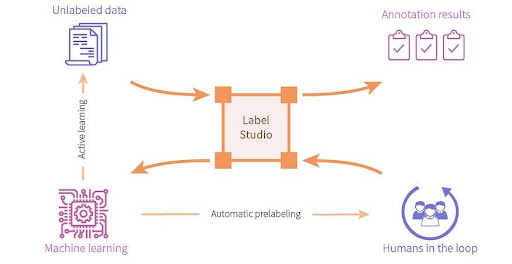

# Spanda.AI Platform - Data Management
 

## Part One: Data Storage and Management

### Core Data Management Framework
#### FAIR Data Principles
- **Findable**: Implement metadata tagging, DOI assignment, and search indexing
- **Accessible**: Provide multiple access methods via standard protocols (HTTP/HTTPS)
- **Interoperable**: Adopt Educational Data Structure (EDS) standards
- **Reusable**: Clear data use agreements and community standards

#### Data Submission Process
(TBD For EdTech domain - might have to create from scratch, we can do this at the very end, we can setup existing platform pieces first)

- Create a standardized metadata schema (discipline-dependent and independent)
- Implement automated validation similar to BIDS validator
- Ensure de-identification of data (remove 18 personal identifiers per HIPAA)

#### Privacy Protection
- Attribute-Based Access Control (ABAC)
- Decentralized Identifiers (DIDs) for personal data ownership
- Informed consent documentation for data sharing

### Data Architecture


Implement a Data Lakehouse architecture that combines:

#### Data Lake
- Store raw, unstructured, and semi-structured data
- Maintain data in original format for maximum flexibility
- Scalable storage on cloud platforms

#### Data Warehouse
- Structured data organization
- Optimized for querying and analysis
- Supports SQL-based tools

#### Processing Layer
- Tools like Apache Spark and Apache Hive
- Data transformation capabilities
- Machine learning and analytics support


### Implementation Tools


#### Optimized Data Lakehouse Stack: Justification & Setup Guide

##### 1. Overview
This document outlines the final optimized stack for a Data Lakehouse setup, detailing the role of each selected component, the justification for its inclusion, and the initial steps to get started using GitHub repositories.

##### 2. Final Optimized Stack

| Component | Keep? | Justification |
|-----------|-------|---------------|
| Dremio | ✅ Yes | Acts as the Data Lakehouse query engine, integrating with Apache Iceberg and MinIO. Provides high-performance analytics over raw and structured data. |
| Apache Superset | ✅ Yes | A powerful business intelligence (BI) tool for visualization, dashboarding, and reporting over Dremio's queried data. |
| Apache Iceberg | ⚠️ Use as a format, not a separate service | A table format for managing large datasets efficiently. Dremio natively supports Iceberg, so there is no need to manage it separately. |
| Apache Spark | ✅ Yes | Best choice for large-scale data processing, ETL, ML workloads, and analytics. Integrates well with Dremio and Iceberg. |
| MinIO | ⚠️ Keep if self-hosting storage (best to set this up for demos and using it in our use-case) | Required only if you need a self-hosted object storage alternative to AWS S3, GCP Storage, or Azure Blob Storage (we require it for missing pieces). |

##### 3. Component Details & Justification

###### 3.1 Dremio
**What it does:**
- Acts as a high-performance SQL query engine for data lakes.
- Eliminates the need for a traditional data warehouse.
- Provides native support for Apache Iceberg and object storage solutions like MinIO.
- Enables fast BI and ad hoc querying without extensive ETL.

**Why we chose it:**
- Eliminates the complexity of traditional data warehouses.
- Provides self-service analytics without excessive data movement.
- Works natively with Apache Iceberg for optimized query performance.

**GitHub Repository:** Dremio OSS

**First Steps:**
- Clone the repository: `git clone https://github.com/dremio/dremio-oss.git`
- Follow the installation guide to deploy on your system.
- Connect your object storage (AWS S3 / MinIO) and start running SQL queries.

###### 3.2 Apache Superset
**What it does:**
- A lightweight BI visualization tool for data analysis and dashboarding.
- Integrates well with Dremio and other SQL-based data sources.
- Provides an easy-to-use UI for creating dashboards.

**Why we chose it:**
- Works seamlessly with Dremio's SQL engine.
- Provides interactive dashboards for end users.
- Open-source alternative to Tableau and Power BI.

**GitHub Repository:** Apache Superset

**First Steps:**
- Clone the repository: `git clone https://github.com/apache/superset.git`
- Follow the installation guide to deploy.
- Connect Superset to Dremio and start building dashboards.

###### 3.3 Apache Iceberg
(This comes out of the box with dremio, so there is no need to install separately)

**What it does:**
- A high-performance table format for organizing large datasets in a data lake.
- Supports ACID transactions, schema evolution, and time travel.
- Works with Dremio, Apache Spark, and other engines.

**Why we chose it:**
- Dremio natively supports Iceberg, so we don't need to manage it separately.
- Provides efficient data organization while keeping data accessible.
- Optimized for query performance on large-scale datasets.

**GitHub Repository:** Apache Iceberg

**First Steps:**
- Ensure Dremio is set up and configured to use Iceberg.
- Follow the Iceberg Quickstart guide to create tables.
- Enable Iceberg in Dremio's settings for optimized query performance.

###### 3.4 Apache Spark
**What it does:**
- A distributed computing engine for large-scale data processing.
- Supports SQL, machine learning, streaming, and ETL workflows.
- Works with Dremio and Iceberg to process raw data efficiently.

**Why we chose it:**
- Best for large-scale data processing (ETL, ML, and batch jobs).
- Integrates natively with Dremio and Iceberg.
- Provides scalability for handling massive datasets.

**GitHub Repository:** Apache Spark

**First Steps:**
- Clone the repository: `git clone https://github.com/apache/spark.git`
- Follow the official documentation for setup.
- Configure Spark to read/write Iceberg tables in your data lake.

###### 3.5 MinIO
**What it does:**
- A self-hosted object storage solution, similar to AWS S3.
- Provides high-performance, scalable storage for unstructured and semi-structured data.
- Works with Dremio, Iceberg, and Spark for efficient storage and retrieval.

**Why we chose it (conditionally):**
- Only needed if self-hosting storage (e.g., not using AWS/GCP/Azure).
- Offers high availability and redundancy for object storage.

**GitHub Repository:** MinIO

**First Steps:**
- Clone the repository: `git clone https://github.com/minio/minio.git`
- Follow the installation guide for deployment.
- Configure MinIO as a data source for Dremio.

##### 4. Next Steps & Deployment Plan
1. Set up Dremio and connect it to your storage solution (AWS S3, MinIO, or other).
2. Install Apache Superset and configure it to use Dremio as a data source.
3. Enable Apache Iceberg inside Dremio for table optimization.
4. Deploy Apache Spark to run ETL workloads and interact with Iceberg tables.
5. If using MinIO, set it up and ensure Dremio can access it.

This setup ensures an efficient, scalable Lakehouse architecture optimized for query performance, analytics, and large-scale data processing.

## Part Two: Data Annotation, Pipeline Debt, and Testing in MLOps

### Table of Contents
1. Introduction
2. Data Annotation with Label Studio
3. Managing Pipeline Debt
4. Data Testing with Great Expectations
5. Model Testing Strategies
6. Implementation Roadmap
7. GitHub Repositories and Resources

### Introduction
This guide provides a comprehensive overview of essential MLOps components to build robust machine learning systems that avoid the "Debt Collection Day" scenario. It covers:
- Data annotation tools to improve data quality and model training
- Pipeline debt management to prevent cascading failures
- Data validation to ensure data quality and detect drift
- Model testing strategies to verify model behavior beyond simple metrics

Each section explains the component's function, its importance in production ML systems, and practical implementation steps.

### Data Annotation with Label Studio





#### What It Does
Label Studio is an open-source data labeling tool that provides:
- A configurable interface for annotating text, images, and audio
- Machine learning integration for pre-labeling and active learning
- Team collaboration support
- Export capabilities to common ML formats (COCO, VOC, CONLL, etc.)
- Model prediction comparison for verification

#### Why We Need It
High-quality labeled data is essential for successful ML projects. Label Studio addresses key challenges:
- Data Quality Improvement: Ensures consistent labeling
- Unstructured Data Handling: Supports text, images, and audio
- Model Validation: Compares predictions from different models
- Edge Case Management: Identifies and labels difficult examples
- Human-in-the-Loop Learning: Integrates human feedback for improvements

#### Getting Started
```
pip install label-studio
label-studio start my_project --init
```

### Managing Pipeline Debt

#### What It Is
Pipeline debt arises from undocumented, untested, and unstable data pipelines, leading to brittle ML systems. Symptoms include:
- Entangled dependencies
- Lack of visibility in data transformations
- Difficult debugging and maintenance
- Cascading failures affecting multiple teams

#### Prevention Strategies
- Documentation: Track all pipeline components and transformations
- Testing: Implement tests for data pipelines
- Monitoring: Track pipeline health and data quality metrics
- Governance: Establish standards for modifications
- Visibility: Use dashboards to track dependencies

### Data Testing with Great Expectations

#### What It Does
Great Expectations provides:
- Declarative syntax for defining data quality expectations
- Automatic data documentation generation
- Integration with Pandas, SQL, and Spark
- CI/CD integration for automated validation

#### Why We Need It
- Preventing Bad Data: Stops problematic data from reaching models
- Early Warning: Detects data drift
- Documentation: Generates data quality reports
- Knowledge Sharing: Makes data assumptions explicit
- Outlier Detection: Prevents model failures

#### Getting Started
```
pip install great_expectations
great_expectations init
great_expectations suite new
```

### Model Testing Strategies


#### Key Strategies
- Pre-train tests: Validate architecture and data setup
- Post-train tests: Verify trained model behaviors
- Invariance tests: Ensure consistent predictions with specific input changes
- Directional expectation tests: Verify expected changes in outputs
- Minimum functionality tests: Validate performance in critical scenarios

#### Implementation Approaches
- Automated test suites: Use GitHub Actions or Jenkins
- Smoke tests: Quick validation of model training and prediction
- Behavioral test suites: Tests organized around model capabilities
- Manual validation: Expert review of test results
- A/B testing: Compare models in production

### Implementation Roadmap

#### Phase 1: Set Up Data Annotation
- Install Label Studio and configure data types
- Define annotation guidelines
- Set up ML-assisted labeling
- Begin annotating datasets

#### Phase 2: Implement Data Testing
- Install Great Expectations
- Profile existing datasets
- Create expectation suites
- Integrate validation into ingestion pipelines

#### Phase 3: Address Pipeline Debt
- Document all pipelines and dependencies
- Implement pipeline health monitoring
- Establish governance standards
- Refactor unstable pipelines

#### Phase 4: Implement Model Testing
- Create pre-train test suites
- Develop invariance and directional tests
- Automate testing in CI/CD pipelines
- Establish manual validation processes

### GitHub Repositories and Resources

#### Data Annotation
- Label Studio
- LLM Data Annotation

#### Data Testing
- Great Expectations
- Pandera
- Deepchecks

#### Model Testing (Let me know if anything here overlaps with Promptfoo)
- CheckList
- Snorkel
- Alibi Detect

#### Drift Monitoring
- Drift Monitoring
- EvidentialyAI
- Whylogs

#### MLOps Frameworks
- MLflow
- Kubeflow
- DVC